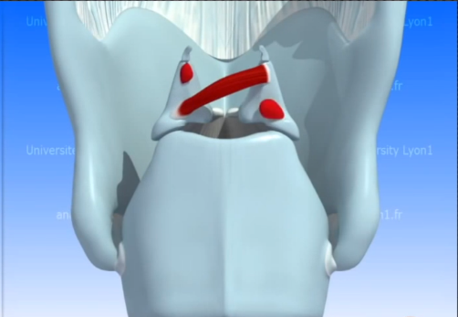

1. 喉结

   

2. 甲状软骨

   

3. 声带

   

# 控制声带的肌肉

1. 甲杓肌（简称TA肌肉）---负责缩短声带

   

2. 环甲肌（简称CT肌肉）---负责拉长声带

   

3. 横杓肌和斜杓肌（简称A肌）---负责声带靠拢 

   

   

4. 环杓后肌（简称PCA）---负责打开声带

   

5. 环侧杓肌（简称PCA）---负责声带收紧闭合

   